# 🪦 CRYPT

**Resurrect your wallet's on-chain history into shareable, mintable trading cards.**

Crypt is a Solana app that scans any wallet's transaction history and transforms it into collectible Crypt Cards — each with a unique rarity score, generative "Soul Signature" art, AI narration, and an audio-reactive soundtrack. Mint your cards as compressed NFTs and share them in the social feed.

> **Built for the [Solana Graveyard Hackathon 2026](https://solana.com/graveyard-hack)**

🔗 **Live Demo:** [crypt-phi-two.vercel.app](https://crypt-phi-two.vercel.app)

---

## 🎬 How It Works

1. **Connect your Solana wallet** (Phantom, Solflare, Backpack) or paste any address
2. **Scanner analyzes your transaction history** via Helius DAS API — swaps, mints, rugs, diamond hands, big moves
3. **Cards are generated** with rarity scores, AI narrations, and matched soundtracks from Audius
4. **Soul Signature generative art** is created deterministically from each transaction hash — no two are alike
5. **Mint your card** as a compressed NFT in the on-chain mint ceremony
6. **Browse the feed**, discover other wallets, like and share cards

---

## 🏗️ Architecture

```mermaid
graph TB
    subgraph CLIENT["Frontend — React + Vite"]
        LP["Landing Page"] --> WC["Wallet Connect"]
        WC --> SC["Scanner Engine"]
        SC --> CG["Card Generator"]
        CG --> SS["Soul Signature Art"]
        CG --> FD["Social Feed"]
        FD --> MC["Mint Ceremony"]
    end

    subgraph APIS["External APIs"]
        HEL["Helius DAS — Transaction History"]
        TAP["Tapestry — Social Identity"]
        AUD["Audius — Music Streaming"]
    end

    subgraph SOLANA["Solana Blockchain"]
        MINT["Compressed NFT Program"]
        META["On-Chain Metadata"]
    end

    SC --> HEL
    WC --> TAP
    SS --> AUD
    MC --> MINT
    MINT --> META
```



See [`/docs`](./docs) for detailed architecture, user flow, data flow, and tech stack diagrams.

---

## ⚡ Sponsor Integration

### Helius — Transaction Intelligence
- **DAS API** for enhanced transaction parsing with token metadata resolution
- Classifies transactions into 5 types: swaps, mints, rug pulls, diamond hands, big moves
- Calculates PnL, identifies platforms (Jupiter, Raydium, etc.)
- Powers the rarity scoring algorithm

### Tapestry Protocol — On-Chain Social
- Resolves wallet addresses to social profiles (`.sol` domains, usernames)
- Powers the follow graph and social feed
- On-chain identity tied to each Crypt Card

### Audius — Decentralized Music
- Each card gets a matched soundtrack from Audius based on transaction mood
- **Audio-reactive generative art** — Soul Signatures respond to real-time audio frequencies via Web Audio FFT analysis

### Exchange Art — Digital Art
- Soul Signature generative art engine creates unique 1/1 art per transaction hash
- Deterministic pixel art with audio reactivity — pushing boundaries of on-chain creative tools
- Each card is a mintable digital art piece with rarity tiers

### DRiP — NFT Distribution
- Crypt Cards distributed as DRiP drops — shareable collectible moments from wallet history
- Each card is a unique NFT drop showcasing on-chain activity as art

---

## 🎴 The Crypt Card System

### Transaction Types
| Type | Icon | Description |
|------|------|-------------|
| Swap | ⚡ | Token exchanges with PnL tracking |
| Rug Pull | ☠ | Tokens that lost 95%+ value |
| Mint | † | NFT mints with collection data |
| Diamond Hands | ◆ | Long-term HODLs with unrealized gains |
| Big Move | ▲ | Large transfers (whale activity) |

### Rarity Tiers
| Tier | Score | Description |
|------|-------|-------------|
| **Legendary** | 75+ | Purple holographic border + particle burst |
| **Rare** | 40-74 | Green glow shimmer border |
| **Common** | 0-39 | Standard card |

### Soul Signature Art
Each transaction hash deterministically generates unique generative art with particle systems, afterlife portals, rarity-derived color palettes, and audio reactivity.

---

## 🎮 Mint Ceremony

A cinematic 6-second ceremony: card lifts → 200 energy particles spiral inward → 360° rotation → explosion with 80 debris particles → spectral rings → "SOUL PRESERVED ON-CHAIN" confirmation.

---

## 🛠️ Tech Stack

| Layer | Technology |
|-------|-----------|
| Frontend | React 18, Vite 5 |
| Art Engine | HTML5 Canvas, generative art system |
| Audio | Web Audio API (FFT), Audius streaming |
| Wallet | @solana/web3.js, Wallet Adapter |
| Blockchain | Solana, Anchor (Rust), Bubblegum cNFTs |
| APIs | Helius DAS, Tapestry Protocol, Audius |
| Deploy | Vercel (Edge) |

---

## 🚀 Getting Started

```bash
git clone https://github.com/BigSiggis/Crypt.git
cd Crypt
cp .env.example .env
npm install
npm run dev
```

Get a Helius API key at [helius.dev](https://helius.dev)

---

## 🗺️ Roadmap

- [x] Wallet scanner with Helius DAS
- [x] Soul Signature generative art engine
- [x] Audio-reactive visuals
- [x] Mint ceremony animation
- [x] Tapestry social identity
- [x] Arcade graveyard landing page
- [ ] Anchor program for on-chain cNFT minting
- [ ] Live community feed
- [ ] Leaderboard — most legendary wallets
- [ ] Card trading
- [ ] Mobile app

---

## 📄 License

Business Source License 1.1 — see [LICENSE](./LICENSE)

## 👤 Contact

**Siggi** — [@BigSiggis](https://github.com/BigSiggis) · bigsiggis@gmail.com · Telegram: @big_siggis

*Built with 🪦 for the Solana Graveyard Hackathon 2026*
